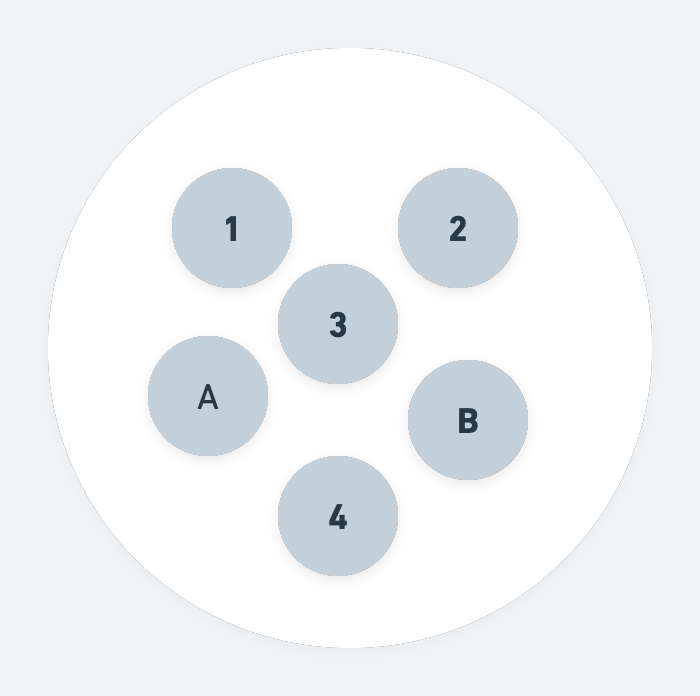
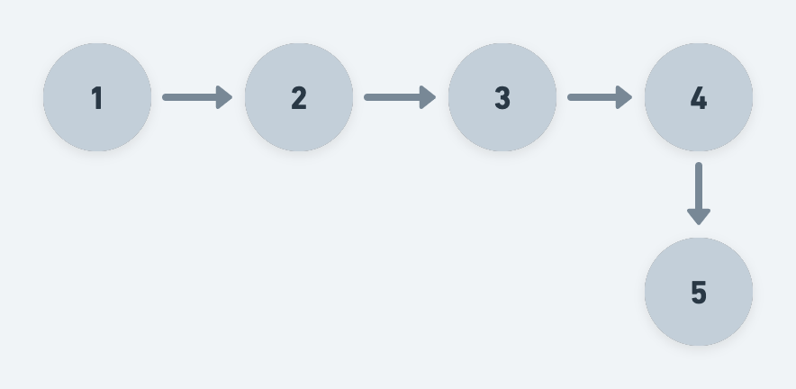

# 数据结构的逻辑分类

根据数据对象中数据元素的之间的相互关系。可以将数据结构进行逻辑分类：

1. 集合结构

满足数学概念中的集合概念，每个元素的地位相同，无序，互异（请参考 [集合](./sets.md)）。

2. 线性结构

线性结构：线性结构中的元素之间存在一对一的关系。

3. 树形结构

用来模拟有树状结构的数据，元素之间呈现一对多的层次关系。[树](./tree.md) 就是来描述这样的一种结构。

4. 图形结构

图形结构的元素是多对多的关系。[图](./graph.md) 就是来描述这样的一种结构。