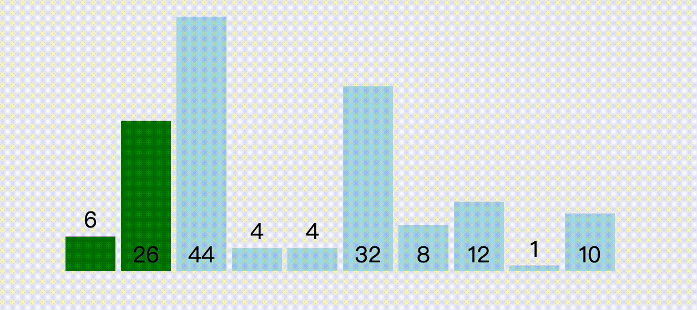
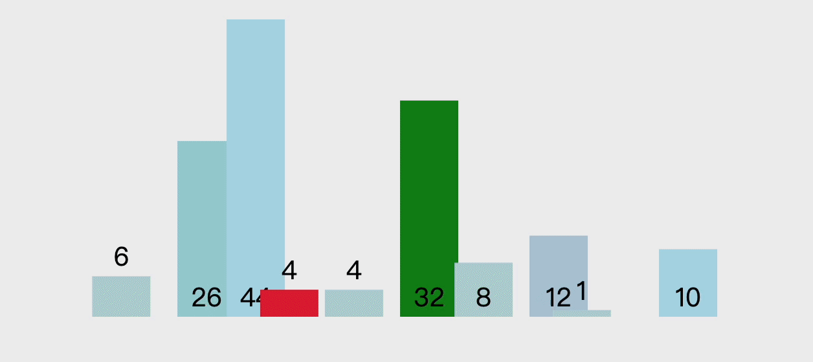
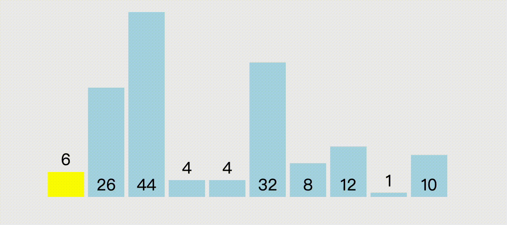

# 排序

排序就是将输入的数字按照从小到大（或从大到小）的顺序进行排列。

## 冒泡排序

冒泡排序（Bubble Sort）就是 “通过重复比较相邻的两个元素，一次循环找出最大的那个元素”。

冒泡排序的时间复杂度为 O(n²)。

## 选择排序

选择排序（Selection Sort）是 “不断在待排序的数据中寻找最小值” 的排序手段。

选择排序和冒泡排序的时间复杂度一样，为 O(n²)。

## 快速排序

快速排序（Quick Sort）会在序列中随机选择一个基准值（pivot，通常会选择第一个元素），然后将其他数分成比基准值小和大的两个部分。在左右两个序列中处理相同进行相同的操作。快速排序采用了一种 “分治法”，往往会使用递归的方式来实现。

基准值对快速排序的时间影响很大。如果每次选择的基准值都能使得两个子序列的长度为原来的一半，那么快速排序的时间复杂度为 O(nlogn)。最差的情况，即每次都选择最小值（或最大值）作为基准值，则时间复杂度为 O(n²)。

## 参考

+ [排序算法的动态展示](https://visualgo.net/zh/sorting)
