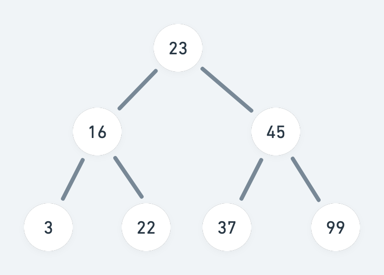

# 树

在计算机科学中，树由一组以边连接的节点组成，用来模拟有树状结构性质的数据。

## 树的一些术语

树是由一组以边连接的节点组成，如下图所示，包含大写字母的A、B、C... 即为树的节点，字母间相连的短线，即为边。


+ **节点的度**

节点拥有的子树的个数，称为节点的度（Degree）。度为 0 的节点，称为 **叶子节点**。在上图中，A 为根节点，E、F、G、H、I 均为叶子节点，它们的度为 0；

其中，D 的度为 3，是这棵树节点最大的度，也称为**树的度**。

+ **节点的层**

节点的层（Level）从根开始定义，根为第一层，根的孩子为第二层。节点中最大的层次，也叫做树的深度（Depth）。当前树的深度为 4。

## 树的分类

按照 **子节点之间有无顺序关系**，可将树分为有序树和无序树。其中「有序树」又可以进一步分为：

1. 二叉树
2. 霍夫曼树
3. B 树

「二叉树」的每个节点最多含有两个子树，分支通常称为左子树和右子树。

## 树的 ADT 描述

我们给出树的一些基本和常用操作：

```text
ADT tree
Data
  由一个根节点和若干子树组成。
Operation
  constructor(): 构造一棵空树
  insert(): 插入一个节点
  root(): 返回根节点
  traverse(): 遍历整棵树
```

## 二叉树的定义

二叉树的每个节点最多有两颗子树，所以二叉树不存在度大于 2 的节点。如下图，所有节点的度都不超过 2，所以是一棵标准的二叉树。



### 二叉树的节点定义

树的节点一个元素，以及若干个指向子树的分支；而二叉树最多只有左子树和右子树。因此可以定义出二叉树的节点：

```typescript
class BinaryTreeNode<T> {
  public data: T;
  public left: BinaryTreeNode<T> | null;
  public right: BinaryTreeNode<T> | null;

  constructor (data: T, left?: BinaryTreeNode<T>, right?: BinaryTreeNode<T>) {
    this.data = data;
    this.left = left ?? null;
    this.right = right ?? null;
  }
}
```

实现一个 BinaryTreeNode 类来定义二叉树的节点，其中 `data` 存放数据或元素（也称数据域），`left` 和 `right` 分别指向左子树和右子树（也称指针域）。

### 二叉树的定义

有了节点的定义，继续定义一个 BinaryTree 类来定义一个二叉树。

```typescript
class BinaryTree<T> {
  #root: BinaryTreeNode<T> = null; // 默认为空树
}
```

对于树来说，我们可以从根节点遍历到所有的子树，因此只需定义一个内部根节点，默认为空树。

## 插入二叉树

将一个元素插入二叉树存在多种策略，这里介绍一种特殊的二叉树：二叉查找树（Binary Search Tree）。它是一棵空树，或者具有一下性质：若它的左子树不空，则左子树上所有结点的值均小于它的根结点的值； 若它的右子树不空，则右子树上所有结点的值均大于它的根结点的值；它的左、右子树也分别为二叉排序树。

下图展示了搜索二叉树插入 [23,16,45,3,22,37,99] 的过程：


其算法描述如下：

1. 设根节点为当前节点。
2. 若待插入的节点保存的数据小于当前节点，则设新的当前节点为原节点左节点；反之，设当前节点为原节点的右节点。
3. 如果当前节点的左节点为 null（或右节点为 null），就将新的节点插入这个位置。

代码实现如下：

```typescript
class BSTree {
  #root: BinaryTreeNode<number> = null; // 默认为空树

  public insert (data: number) {
    const node = new BinaryTreeNode(data);

    // 没有根节点，设置为当前根节点
    if (this.#root === null) {
      this.#root = node;
    } else {
      let current = this.#root;
      let parent = null;
      while (true) {
        parent = current;

        if (data < current.data) {
          current = current.left;

          if (current === null) {
            parent.left = node;
            break;
          }
        } else {
          current = current.right;

          if (current === null) {
            parent.right = node;
            break;
          }
        }
      }
    }
  }
}
```

## 遍历二叉树

二叉树的遍历方式，主要分为深度优先遍历和广度优先遍历。其中深度优先遍历，按照**访问根节点**的顺序，分为先序遍历、中序遍历和后序遍历，通常使用递归来实现；广度优先遍历，又称为层序遍历，通常使用队列来实现。

1. **先序遍历**

先访问根节点，然后遍历左子树，再遍历右子树遍历方式。如，下图二叉树的先序遍历结果为：[23,16,3,2,45,37,99]。


2. **中序遍历**

先遍历左子树，然后访问根节点，最后遍历右子树。下图二叉树的中序遍历结果为：[3,16,22,23,37,45,99]。


3. **后序遍历**

先遍历左子树，再遍历右子树，最后访问根节点。下图二叉树的后序遍历结果为：[3，22,16,37,99,45,23]。


4. **层序遍历**


## 二叉搜索树

二叉查找树（Binary Search Tree）是一种特殊的二叉树，相对较小的值保存在左节点，较大的值保存在右节点。这一特性，使得数据查找的效率相当高。
