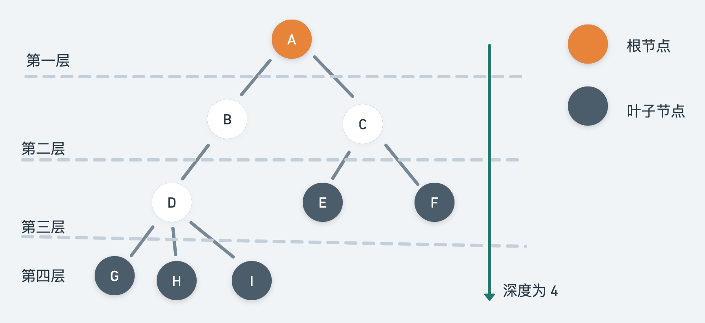
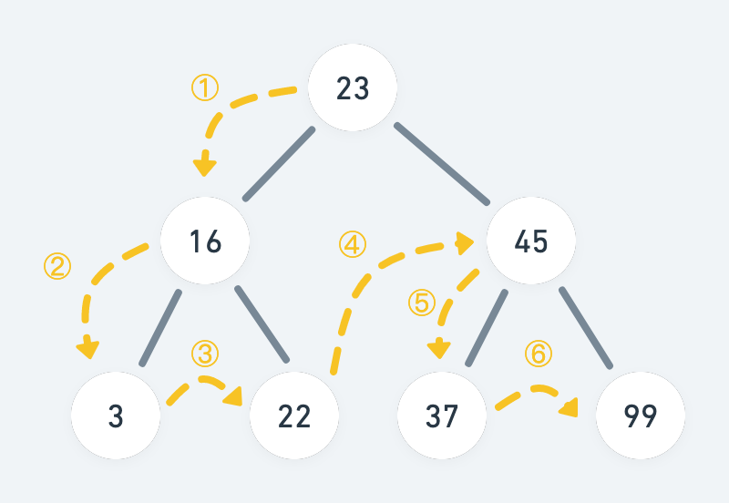
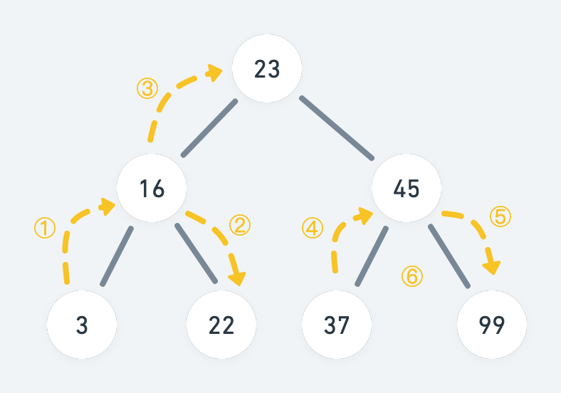
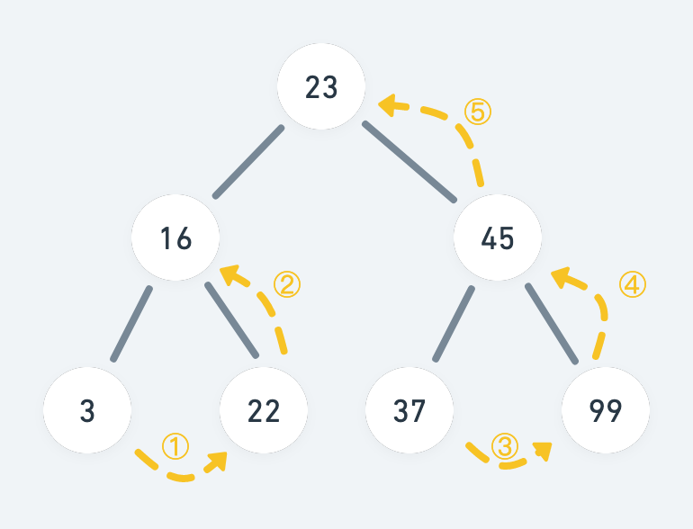

# 树

在计算机科学中，树由一组以边连接的节点组成，用来模拟有树状结构性质的数据。

## 树的一些术语

树是由一组以边连接的节点组成，如下图所示，包含大写字母的A、B、C... 即为树的节点，字母间相连的短线，即为边。

+ **节点的度**

节点拥有的子树的个数，称为节点的度（Degree）。度为 0 的节点，称为 **叶子节点**。在上图中，A 为根节点，E、F、G、H、I 均为叶子节点，它们的度为 0；

其中，D 的度为 3，是这棵树节点最大的度，也称为**树的度**。

+ **节点的层**

节点的层（Level）从根开始定义，根为第一层，根的孩子为第二层。节点中最大的层次，也叫做树的深度（Depth）。当前树的深度为 4。

## 树的分类

按照 **子节点之间有无顺序关系**，可将树分为有序树和无序树。其中「有序树」又可以进一步分为：

1. 二叉树
2. 霍夫曼树
3. B 树

「二叉树」的每个节点最多含有两个子树，分支通常称为左子树和右子树。

## 二叉树

## 遍历二叉树

二叉树的遍历方式，主要分为深度优先遍历和广度优先遍历。其中深度优先遍历，按照**访问根节点**的顺序，分为先序遍历、中序遍历和后序遍历，通常使用递归来实现；广度优先遍历，又称为层序遍历，通常使用队列来实现。

1. **先序遍历**

先访问根节点，然后遍历左子树，再遍历右子树遍历方式。如，下图二叉树的先序遍历结果为：[23,16,3,2,45,37,99]。

2. **中序遍历**

先遍历左子树，然后访问根节点，最后遍历右子树。下图二叉树的中序遍历结果为：[3,16,22,23,37,45,99]。

3. **后序遍历**

先遍历左子树，再遍历右子树，最后访问根节点。下图二叉树的后序遍历结果为：[3，22,16,37,99,45,23]。

4. **层序遍历**

## 二叉搜索树

二叉查找树（Binary Search Tree）是一种特殊的二叉树，相对较小的值保存在左节点，较大的值保存在右节点。这一特性，使得数据查找的效率相当高。
